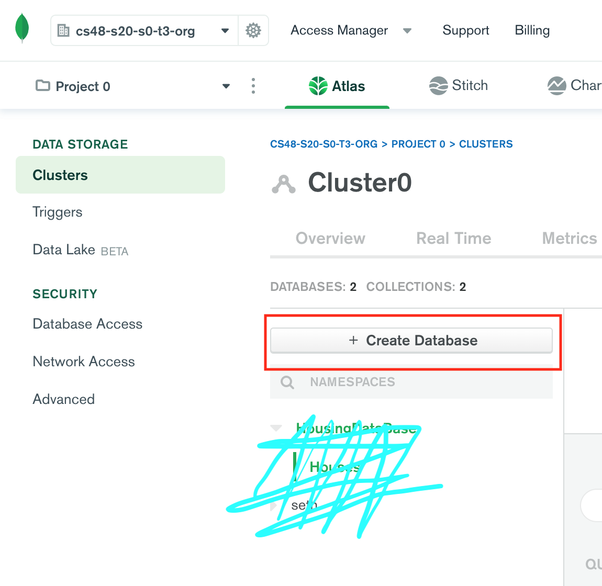
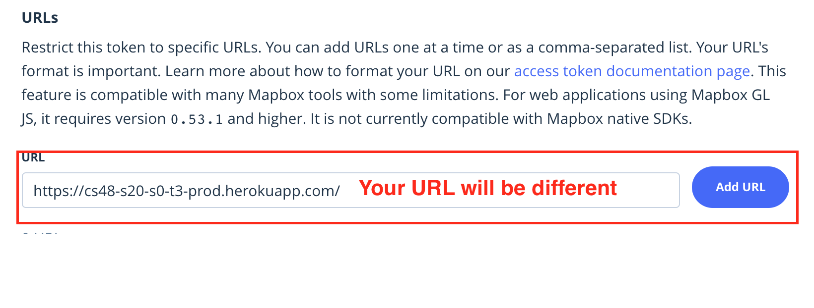
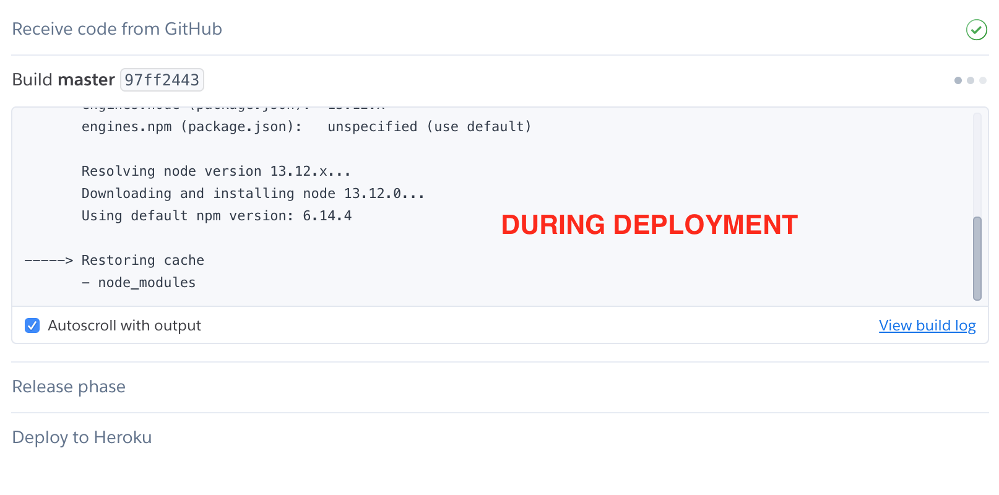

# Instructions for Deployment (to deploy you will need a github account)
* video instructions: https://www.youtube.com/watch?v=jtsq72x04v0
## 1. Fork repo onto your own github account
  * Goto https://github.com/ucsb-cs48-s20/project-s0-t3-iv-housing and click on the fork button in the top right. 
  
  * A popup will appear asking you to choose where to fork the repo to. Select your Github account. 
  
  * This will clone the repository to your accounts repositories so you have your own copy of the code. 
## 2. Setup Heroku account and applictaion
  * If you don’t have a Heroku Account yet, please create a Heroku account by logging in at https://heroku.com
    * Click the “Sign up for Free” link. You’ll be asked for:
    * First Name, Last Name
    * Email (we suggest using your @ucsb.edu email, but that’s up to you)
    * Company (you may leave this blank).
    * Preferred Development Language: choose JavaScript
  * NOTE for folks with existing Heroku Accounts: You might need to delete old apps to make space for new ones. There is a limit of five apps on the free tier of Heroku (unless/until you enter a credit card.)
  * login to the Heroku Dashboard https://dashboard.heroku.com
  
  * create a new Heroku app called, for example: iv-housing-prod-clone 
  * This application will now be add to your Heroku Dashboad and when you click on it, it will take you to your Heroku application home page. 
  
## 3. Setup MongoDB account and add MONGODB_URI to Heroku 
  * Follow the directions here https://ucsb-cs48.github.io/topics/mongodb_cloud_atlas_setup/ to create a mongoDB account and get your MongoDB URI. 
  * After you create the URI make sure to copy it. Go to your Heroku application home page at `https://dashboard.heroku.com/apps/<your heroku applicatin name here>` and click on the "Settings" menu on the top navbar. The second section on this page should be Config Vars. In this section click on the white/purple "Reveal Config Vars" button. Add a new Config Var with KEY set to "MONGODB_URI" (without quotation marks) and paste the URI into Value.
  
  * Now go back to the MongoDB page https://cloud.mongodb.com/. From here click on the collections button under your cluster. 
  
  * Now click on the "Create Database" button. Name the Database "HousingDataBase" and name the collection "Houses". 
  
  * Click on the Database and then the collection.
  
    * You will repeat this step 4 times with the following house information below. Click on "Insert Document" on the right. Change the View on the top of the popup to {} instead of table. Then paste in the house info for one house after the closing bracket on line 4.
    
    * House 1 Info: `,"company":"Playa Life IV","address":"6561 Del Playa Dr. #4","size":{"$numberInt":"7"},"totalPrice":{"$numberInt":"6000"},"pricePerPerson":{"$numberInt":"0"},"website":"https://www.playalifeiv.com/listings/detail/7dda3077-fbb0-4464-870c-bbdac7147243","phone":"(805)603-4777","lat":{"$numberDouble":"34.409286"},"lng":{"$numberDouble":"-119.85692"}`
    * House 2 Info: `,"company":"Wolfe and Associates","address":"6545 Picasso Rd. #2","size":{"$numberInt":"4"},"totalPrice":{"$numberInt":"2800"},"pricePerPerson":"0","website":"https://www.rlwa.com/listings/detail/461184c0-bb41-4c31-ac33-9d5ec142f4f0","phone":"(805)964-6770","lat":{"$numberDouble":"34.414924"},"lng":{"$numberDouble":"-119.85623"}`
    * House 3 Info: `,"company":"KAMAP","address":"6521 Cordoba Rd. #33","size":{"$numberInt":"2"},"totalPrice":{"$numberInt":"1940"},"pricePerPerson":{"$numberInt":"0"},"website":"http://www.kamap.net/boardwalk.html","phone":"(805)685-2627","lat":{"$numberDouble":"34.413804"},"lng":{"$numberDouble":"-119.854406"}`
    * House 4 Info: `,"company":"Meridian Group","address":"820 Camino Corto #4","size":{"$numberInt":"4"},"totalPrice":{"$numberInt":"3050"},"pricePerPerson":"0","website":"https://meridiangrouprem.com/details/?ID=4618","phone":"(805)692-2500","lat":{"$numberDouble":"34.414747"},"lng":{"$numberDouble":"-119.866288"}`
 * Now your database contains 4 IV House listings. 
## 4. Setup Mapbox account and add Map Token to Heroku
  * Go to https://account.mapbox.com/auth/signup/ and signup for a free mapbox account
  * Verify your account through email 
  * On your mapbox account page https://account.mapbox.com/ click on "create a token"
  
      * You can give the token any name, a good one may be something like "IV Housing Map Token"
      * All of the other settings should be left alone
      * This is not neccesary but for extra security of your token, so people do not steal it use up your free map requests, you can restrict the urls that can request a map with this token. This is at the very bottom of the create token page and you should input the URL that your application will be deployed on (aka the Heroku URL, to find it go to the Home Heroku page for your application and click on the purple "open app" button, this should open a new page with your application and you just need to copy the URL)
     
  * After you create the token it should take you to a page with all your access tokens. You should see your new token underneath a default token. Copy this token by clicking the blue clipboard button next to the token. 
  
  * Go to your Heroku application home page  at `https://dashboard.heroku.com/apps/<your heroku applicatin name here>` and click on the "Settings" menu on the top navbar. The second section on this page should be Config Vars. In this section click on the white/purple "Reveal Config Vars" button. Add a new Config Var with KEY set to "MAP_TOKEN_PROD" (without quotation marks) and paste the token into Value. 
  
  * Now your application will have a grey/default map that looks bland. If you want to change this to the themed map used on our appliation just click this link below and then in the bottom right of the window click copy this style to your account. 
  https://api.mapbox.com/styles/v1/sethvanb/cka744x8c16b31ilhulkr0d26.html?fresh=true&title=copy&access_token=pk.eyJ1Ijoic2V0aHZhbmIiLCJhIjoiY2thNjhpaWowMDVseDJybmx2dGVqc3UxeiJ9.MLbmm_S5HaD7ZleO_qGA2A
  
## 5. Deploy app on Heroku
  * Go to your Heroku application home page at `https://dashboard.heroku.com/apps/<your heroku applicatin name here>` and click on the "Deploy" menu on the top navbar.
  
  * Select Github as the Deploy Method and sign into your Github. Then select your account as the organization and search "iv" in the search bar to the right. When the results popup click the "Connect" button next to the repository that you cloned the source code to. 
  
  * Scroll down to the "Manual Deployment" section at the bottom of the page. In the "Choose a branch to deploy" selector pick "master" and then click the grey "Deploy Branch" button to the right of the selector. 
   
  * A samll display should popup at the bottom of the window. Wait until the popup is replaced by 4 sections each checked off and the last one should say "Deploy to Heroku" in green font and have a green check mark to the right.
   
  * Now the application is deployed on the Heroku URL. To get to the application just click the white/purple "View" button at the bottom of the page. This should open a new page with your application. 
